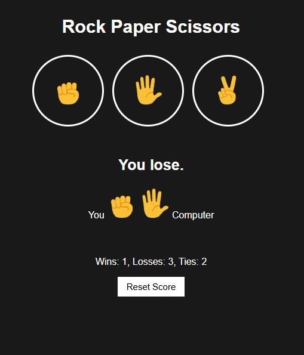

🪨 📄 ✂️ Rock Paper Scissors Game

A classic Rock Paper Scissors game built with HTML, CSS, and JavaScript featuring persistent score tracking.



✨ Features

- Interactive UI: Play with simple button clicks
- Score Tracking: Wins, losses, and ties are recorded
- Persistent Storage: Scores saved between sessions using localStorage
- Responsive Design: Works on desktop and mobile devices

🚀 How to Play

1. Click on Rock, Paper, or Scissors button
2. Computer makes a random selection
3. Game determines winner based on standard rules:
   - Rock crushes Scissors
   - Scissors cut Paper
   - Paper covers Rock
4. Score updates automatically
5. Refresh or close browser - your score remains!

🛠️ Technologies Used

- HTML5
- CSS3
- JavaScript (ES6)
- Web Storage API

📂 Project Structure
rock-paper-scissors/
├── index.html # Main HTML file
├── css/
│ └── style.css # Stylesheet
├── js/
│ └── script.js # Game logic
└── images/ # Game assets

🔧 Installation

No installation needed! Just open `index.html` in any modern browser.

Or run locally:

```bash
git clone https://github.com/DagimDev/rock-paper-scissors.git
cd rock-paper-scissors
open index.html

🤝 Contributing
Contributions welcome! Follow these steps:

1. Fork the project
2. Create your feature branch (git checkout -b feature/awesome-feature)
3. Commit your changes (git commit -m 'Add awesome feature')
4. Push to the branch (git push origin feature/awesome-feature)
5. Open a Pull Request
```
